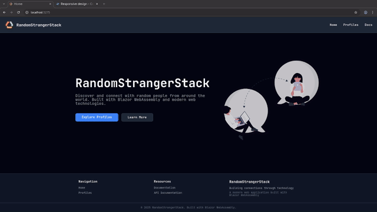

<a id="readme-top"></a>
<!-- PROJECT LOGO -->
<br />
<div align="center">
<a>
  
</a>
</div>
<h3 align="center">RandomStrangerStack</h3>

<!-- TABLE OF CONTENTS -->
<details>
  <summary>Table of Contents</summary>
  <ol>
    <li>
      <a href="#about-the-project">About The Project</a>
      <ul>
        <li><a href="#built-with">Built With</a></li>
        <li><a href="#nuget-packages">NuGet Packages</a></li>
      </ul>
    </li>
    <li>
      <a href="#getting-started">Getting Started</a>
      <ul>
        <li><a href="#prerequisites">Prerequisites</a></li>
        <li><a href="#running-the-project">Running the Project</a></li>
      </ul>
    </li>
    <li><a href="#usage">Usage</a></li>
    <li><a href="#features">Features</a></li>
    <li><a href="#architecture-sections">Architecture</a></li>
    <li><a href="#design-decisions">Design Decisions</a></li>
    <li><a href="#testing">Testing</a></li>
    <li><a href="#acknowledgments">Acknowledgments</a></li>
    <li><a href="#ai-use">AI Use</a></li>
  </ol>
</details>

<!-- ABOUT THE PROJECT -->

## About the project


Random Stranger Stack:
A blazor web assembly app, containing a simple landing page, profile page with a
search bar, drop down and refresh button. All used for displaying user cards
from the https://randomuser.me/ API. Using a CSS lib inspired by tailwind.

<p align="right">(<a href="#readme-top">back to top</a>)</p>

### Built With

This is most of the tech I built the project with.

* [![C#][C#]][C#-url]
* [![Blazor][Blazor]][Blazor-url]
* [![.net][.net]][.net-url]
* [![HTML][HTML]][HTML-url]
* [![CSS][CSS]][CSS-url]

### NuGet packages:

- Markdig _for parsing markdown to
  html_ [Markdig github](https://github.com/xoofx/markdig)
- Moq _for mocking the HttpClient to test
  UserService_  [Moq github](https://github.com/devlooped/moq?tab=readme-ov-file#what)

<p align="right">(<a href="#readme-top">back to top</a>)</p>

<!-- GETTING STARTED -->

## Getting Started

This is how to get up and running with the project.

### Prerequisites

In order to build project, you need to install .NET 10.0

* Install nuget packages
  ```sh
  dotnet restore
  ```
* Compile project into runnable files
  ```sh
  dotnet build
  ```

### Running the project

```bash
dotnet watch
   ```

<p align="right">(<a href="#readme-top">back to top</a>)</p>

<!-- USAGE EXAMPLES -->

## Usage

<div align="center">
  
</div>

Search for users, filter by name/country/gender, when a card is clicked a modal
opens.

<p align="right">(<a href="#readme-top">back to top</a>)</p>

## Features

**Random User Profiles**:  
Here we have the option of fetching 10,25,50 or 100
random users from the random user API.  

**Search and filter:**  
Search by name, gender or country.

**Profile Details**:  
When a user card is clicked a modal is opened, and we display
the full information of the selected profile.  

**Skeleton Loading**:  placeholder loading cards with animation for user cards.   

**Error handling**:  
User friendly error message and a retry option using the
Result pattern  

**Responsive Design**:  
Works from 360px to desktop.  

**Custom CSS utils**:  
I decided to create utility classes inspired by tailwind,
after struggling with tailwind hot module reload in a previous school task.  


<p align="right">(<a href="#readme-top">back to top</a>)</p>

## Architecture sections

The app follows a clean, layered architecture pattern:

**Services Layer** - Business logic separated into dedicated services:

- `IUserService` - Handles API communication and data fetching
- `IUserFilterService` - Manages user filtering logic so it can be used in
  testing too.

**Components** - Reusable UI components with single responsibilities:

- `UserCard` - Displays user information
- `UserDetailsModal` - Shows detailed user information in a modal
- `ProfileControls` - Search, filter, and refresh components

**Models** - Strongly typed data structures:

- `User` - Domain model for user data
- `Result<T>` - Result pattern for handling success/failure state
- `ApiResponse` & related DTOs - mapping the API response

**Dependency Injection** - All services registered in `Program.cs` and injected
where needed and for testability.

<p align="right">(<a href="#readme-top">back to top</a>)</p>

## Design decisions

**Result Pattern** - Instead of throwing exceptions, I use a `Result<T>` type to
handle success/failure states. This makes error handling explicit and easier to
test.

**Custom CSS Utilities** - Built a Tailwind-inspired utility class library
instead of using Tailwind directly.

**Service Extraction** - Filter logic extracted into `UserFilterService` rather
than keeping it in the component. This makes the logic reusable and testable.

**Immutable DTOs** - API response models use `init` setters instead of `set`,
making them immutable after deserialization and preventing accidental mutations.

**Component Composition** - UI broken into small, focused components
(UserCard, Modal, Controls) that can be composed together and tested
independently.


<p align="right">(<a href="#readme-top">back to top</a>)</p>


<!-- TESTING -->

## Testing

### Overview

I have used xUnit for the testing framework and Moq for mocking HTTP
dependencies.

### Structure

exam_blazor_wasm.Tests/

```
|-Unit/
  |- UserServiceTests.cs
  |- FilterTests.cs
  |- ResultTest.cs

|- Integration
  |- ApiIntegrationTests.cs
```

## Running Tests

```bash
cd exam_blazor_wasm.tests
dotnet test
```

### Test Coverage

**UserService Tests**

* `GetUsersAsync_ReturnsUsers_WhenApiSucceeds`  - Here we test that the API
  response maps correctly User model.
* `GetUsersAsync_ReturnsFailure_WhenApiReturnsError` - Here we test the error
  handling when the API fails.
* `GetUsersAsync_ReturnsFailure_WhenNoDataReceived` - Here we make sure the
  handling of an empty response returns an error.

**Filter Tests**

- `Filter_ByName_ReturnsMatchingUsers` - Here we check that the filter works
  with name.
- `Filter_ByGender_ReturnsMatchingUsers` - We check that we can filter by
  gender.
- `Filter_ByCountry_ReturnsMatchingUsers` - We check that filter by country also
  works.
- `Filter_EmptySearch_ReturnsAllUsers` - We check empty search returns all
  users.

**Result Pattern Tests**
Instead of throwing exceptions when something goes wrong or when the API returns
the correct data, We use a result object and update the IsSuccess = false/true,

- `Success_ReturnsIsSuccessTrue` - we check that the API works, and we get a
  result with `IsSuccess = true` and the actual data
- `Failure_ReturnsIsSuccessFalse` - Verifies failure result and update
  `IsSuccess = false` and an error message.

**Integration Tests**

- `GetUsersAsync_ReturnsRealUsers_FromApi` - We test the code against the actual
  API, and verify that we get data back.

<!-- ACKNOWLEDGMENTS -->

## Acknowledgments

These are the pages I have gotten inspiration and fonts, icons, illustrations
etc.

* [Syntax.fm (Typography page)](https://syntax.fm/system/typography)
* [Tailwind(CSS classes inspiration)](https://tailwindcss.com/docs/installation/using-vite)
* [Undraw(Landing page illustration)](https:https://undraw.co/illustrations/3)
* [Realfavicongenerator(Favicon icons)](https://realfavicongenerator.net/your-favicon-is-ready)
* [Google fonts(Icons and fonts)](https://fonts.google.com/icons)
* [Img Shields](https://shields.io)
* [Best-README-Template](https://github.com/othneildrew/Best-README-Template)

## AI Use

Can be found in the AIUSE.md file.

<p align="right">(<a href="#readme-top">back to top</a>)</p>

<!-- MARKDOWN LINKS & IMAGES -->
<!-- https://www.markdownguide.org/basic-syntax/#reference-style-links -->

[HTML]: https://img.shields.io/badge/HTML5-E34F26?logo=html5&logoColor=fff&style=for-the-badge

[HTML-url]: https://developer.mozilla.org/en-US/docs/Web/HTML

[CSS]: https://img.shields.io/badge/CSS-639?logo=css&logoColor=fff&style=for-the-badge

[CSS-url]: https://developer.mozilla.org/en-US/docs/Web/CSS

[C#]:https://img.shields.io/badge/c%23%20-%23239120.svg?&style=for-the-badge&logo=c-sharp&logoColor=white

[C#-url]: https://learn.microsoft.com/en-us/dotnet/csharp/

[.net]: https://img.shields.io/badge/.NET-512BD4?logo=dotnet&logoColor=fff&style=for-the-badge

[.net-url]: https://learn.microsoft.com/en-us/dotnet

[Blazor]:https://img.shields.io/badge/Blazor-512BD4?logo=blazor&logoColor=fff&style=for-the-badge

[Blazor-url]: https://dotnet.microsoft.com/en-us/apps/aspnet/web-apps/blazor


