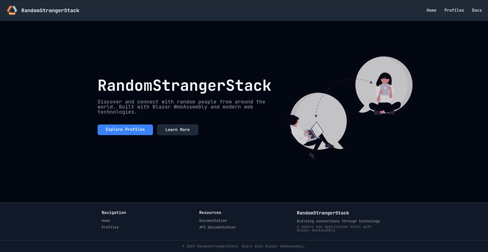

<!-- PROJECT LOGO -->
<br />
<div align="center">

</div>
<h3 align="center">RandomStrangerStack</h3>

<!-- TABLE OF CONTENTS -->
<details>
  <summary>Table of Contents</summary>
  <ol>
    <li>
      <a href="#about-the-project">About The Project</a>
      <ul>
        <li><a href="#built-with">Built With</a></li>
      </ul>
    </li>
    <li>
      <a href="#getting-started">Getting Started</a>
      <ul>
        <li><a href="#prerequisites">Prerequisites</a></li>
        <li><a href="#installation">Installation</a></li>
        <li><a href="#tests">Tests</a></li>
      </ul>
    </li>
  </ol>
</details>

<!-- ABOUT THE PROJECT -->

## About The Project



There are many great README templates available on GitHub; however, I didn't
find one that really suited my needs so I created this enhanced one. I want to
create a README template so amazing that it'll be the last one you ever need --
I think this is it.

Of course, no one template will serve all projects since your needs may be
different. So I'll be adding more in the near future. You may also suggest
changes by forking this repo and creating a pull request or opening an issue.
Thanks to all the people have contributed to expanding this template!

<p align="right">(<a href="#readme-top">back to top</a>)</p>

### Built With

This is most of the tech I built the project with.

* [![C#][C#]][C#-url]
* [![Blazor][Blazor]][Blazor-url]
* [![.net][.net]][.net-url]
* [![HTML][HTML]][HTML-url]
* [![CSS][CSS]][CSS-url]

<p align="right">(<a href="#readme-top">back to top</a>)</p>

<!-- GETTING STARTED -->

## Getting Started

This is an example of how you may give instructions on setting up your project
locally.
To get a local copy up and running follow these simple example steps.

### Prerequisites
In order to build project, you need to install .NET 10.0

* Install nuget packages
  ```sh
  dotnet restore
  ```
* Compile project into runnable files
  ```sh
  dotnet build
  ```

### Running the project

```bash
dotnet watch
   ```

<p align="right">(<a href="#readme-top">back to top</a>)</p>

<!-- USAGE EXAMPLES -->

## Usage

Use this space to show useful examples of how a project can be used. Additional
screenshots, code examples and demos work well in this space. You may also link
to more resources.

<p align="right">(<a href="#readme-top">back to top</a>)</p>


<!-- ACKNOWLEDGMENTS -->

## Acknowledgments

Theese are the pages I have gotten insporation and fonts, icons, illustrations
etc.

* [syntax.fm (Typography page)](https://syntax.fm/system/typography)
* [tailwind(CSS classes inspiration)](https://tailwindcss.com/docs/installation/using-vite)
* [undraw(Landing page illustration)](https:https://undraw.co/illustrations/3)
* [Realfavicongenerator(Favicon icons)](https://realfavicongenerator.net/your-favicon-is-ready)
* [Google fonts(Icons and fonts)](https://fonts.google.com/icons)
* [Img Shields](https://shields.io)
* [Best-README-Template](https://github.com/othneildrew/Best-README-Template)

<p align="right">(<a href="#readme-top">back to top</a>)</p>


<!-- MARKDOWN LINKS & IMAGES -->
<!-- https://www.markdownguide.org/basic-syntax/#reference-style-links -->

[HTML]: https://img.shields.io/badge/HTML5-E34F26?logo=html5&logoColor=fff&style=for-the-badge

[HTML-url]: https://developer.mozilla.org/en-US/docs/Web/HTML

[CSS]: https://img.shields.io/badge/CSS-639?logo=css&logoColor=fff&style=for-the-badge

[CSS-url]: https://developer.mozilla.org/en-US/docs/Web/CSS

[C#]:https://custom-icon-badges.demolab.com/badge/C%23-%23239120.svg?logo=cshrp&logoColor=white

[C#-url]: https://learn.microsoft.com/en-us/dotnet/csharp/

[.net]: https://img.shields.io/badge/.NET-512BD4?logo=dotnet&logoColor=fff&style=for-the-badge

[.net-url]: https://learn.microsoft.com/en-us/dotnet

[Blazor]:https://img.shields.io/badge/Blazor-512BD4?logo=blazor&logoColor=fff&style=for-the-badge

[Blazor-url]: https://dotnet.microsoft.com/en-us/apps/aspnet/web-apps/blazor

### Tech

- Markdig _for parsing markdown to
  html_ [markdig github](https://github.com/xoofx/markdig)
-

### Sources

### Ai use:

Can be found in the AIUSE.md file.